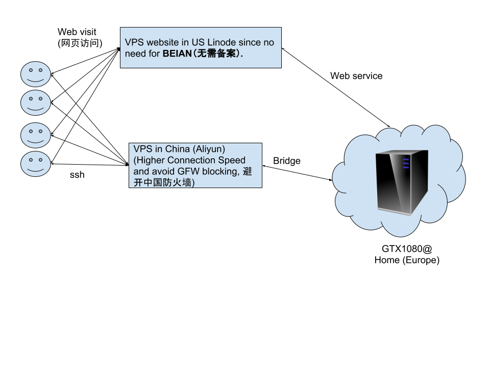

Introduction
============

This is a complex system for sharing gpu at home, see the on-line demo (http://cmachines.chongdata.com). 

This tutorial is NOT written for the beginners. I assume that you already knew the below techniques very well:

  * docker manipulation
  * btrfs configuraiton with docker
  * linux network configuration
  * django installation

Architecture
============

Before installing the gpu solution

